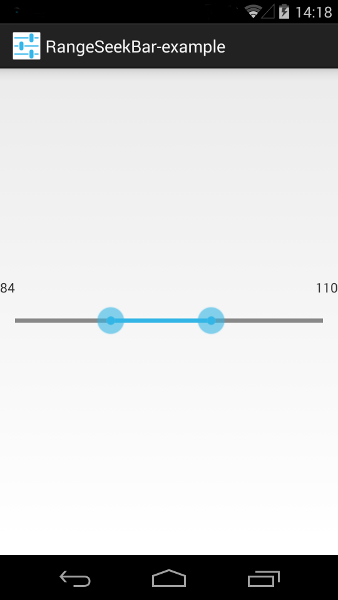

# range-seek-bar

A slider widget for Android allowing to set a minimum and maximum value on a numerical range.
Forked from http://code.google.com/p/range-seek-bar/

## Example application

The project contains a simple example application which uses the library.

## Screenshot

The screenshot shows the example application.

## Members

tittel@kom.e-technik.tu-darmstadt.de

## Licenses

* Code license: Apache License 2.0
* Content license: Creative Commons 3.0 BY
